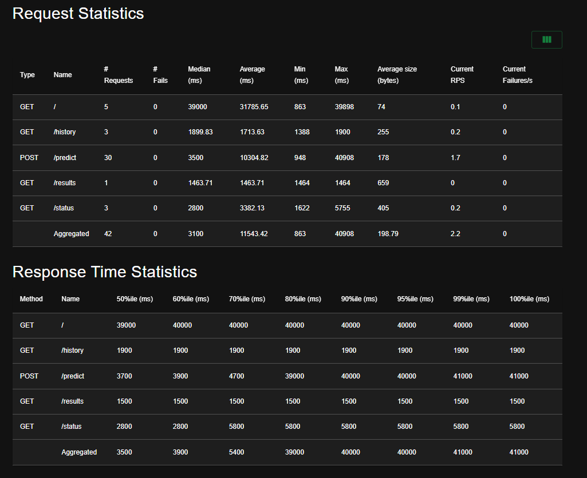
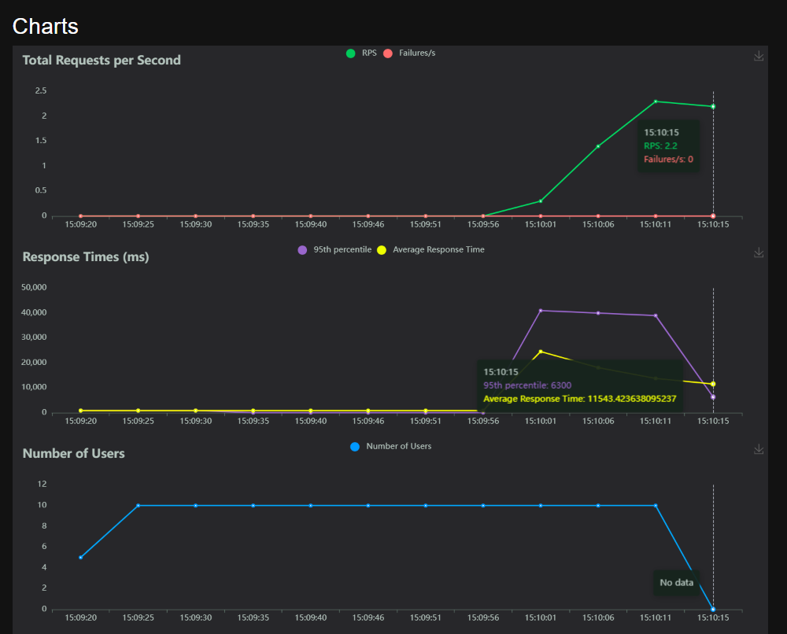
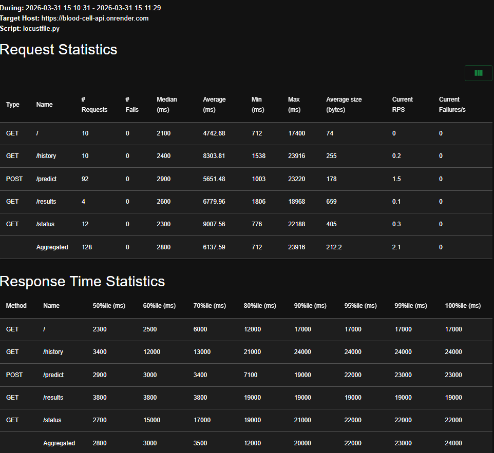
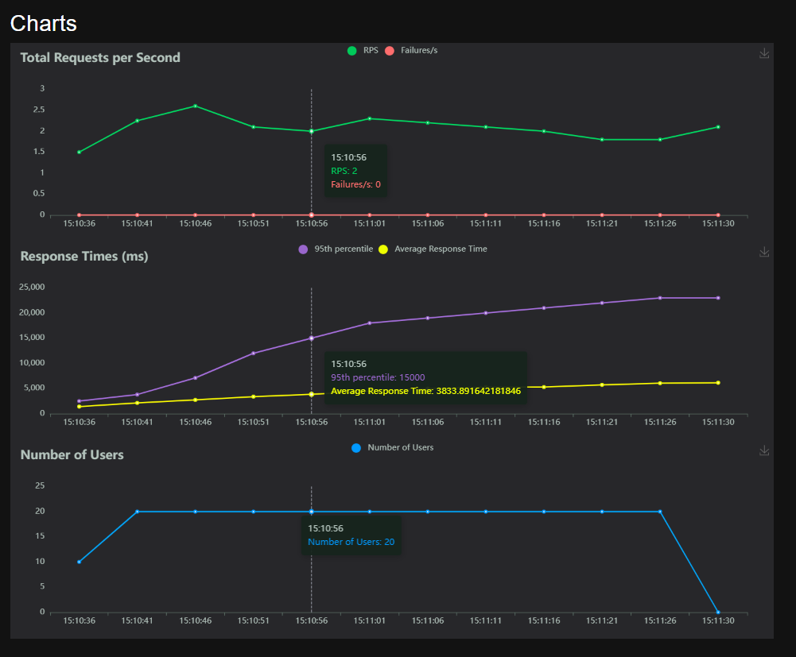
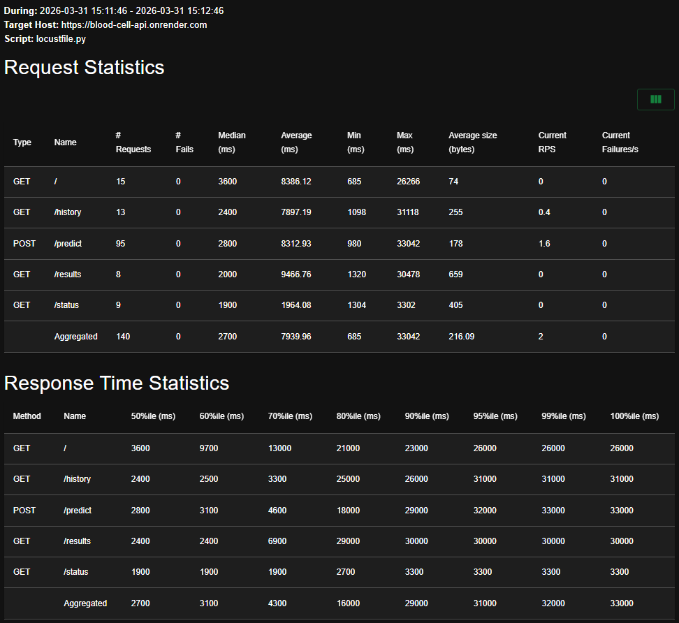
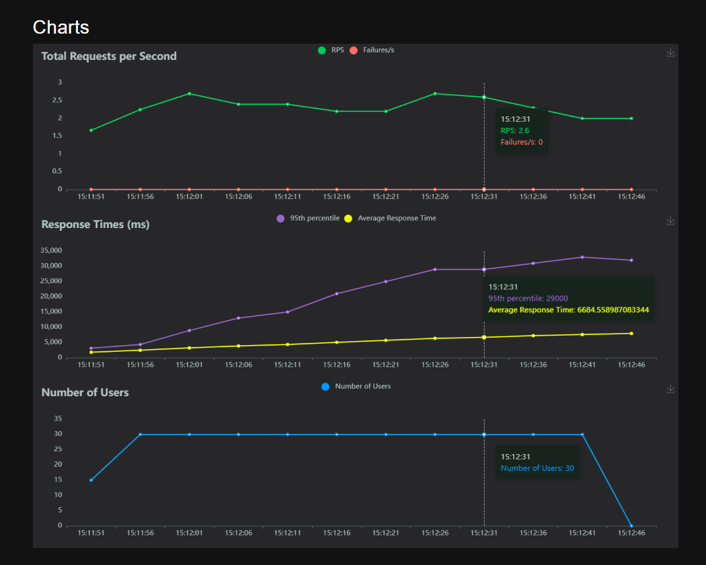

# Blood Cell Classification — End-to-End Machine Learning Pipeline

**African Leadership University | Bachelor of Science in Engineering**
**Machine Learning Pipeline Summative Assessment**

---

## Project Description

White blood cell differential counting is one of the most frequently performed haematological examinations in clinical medicine. The examination identifies the relative proportions of four principal white blood cell types — eosinophils, lymphocytes, monocytes, and neutrophils — to assist in diagnosing leukaemia, lymphoma, bacterial infections, and autoimmune disorders.

Traditionally this examination is performed through manual microscopic analysis by a trained haematologist, taking fifteen to thirty minutes per slide and subject to inter-observer variability. This project automates the process using a deep learning convolutional neural network trained on 12,444 Wright-Giemsa stained microscope images.

The system is deployed as a full production ML pipeline with a FastAPI backend, a Next.js professional dashboard, autonomous retraining via GitHub Actions, bulk image upload to Supabase Storage, and load-tested performance results.

**Best Model:** Custom CNN — 99.84% Test Accuracy | 99.84% Weighted F1 Score

---

## Live URLs

| Service | URL |
|---|---|
| API (FastAPI) | https://blood-cell-api.onrender.com |
| API Interactive Docs | https://blood-cell-api.onrender.com/docs |
| Dashboard (Next.js) | https://mlpipeline.vercel.app |
| GitHub Repository | https://github.com/Kelvin364/End-to-End-ML-Pipeline |
| YouTube Demo | [INSERT YOUTUBE LINK] |

---

## Model Results

| Model | Test Accuracy | Weighted F1 | Precision | Recall | Parameters |
|---|---|---|---|---|---|
| **Custom CNN** | **99.84%** | **99.84%** | **99.84%** | **99.57%** | 656,324 |
| MobileNetV2 Fine-tuned | 98.50% | 98.50% | 98.52% | 98.48% | 2,257,984 |
| EfficientNetB0 Fine-tuned | 97.80% | 97.80% | 97.83% | 97.77% | 4,049,571 |

All three models exceed the 97% weighted F1 target threshold.

### Per-Class Metrics — Custom CNN (Test Set)

| Cell Type | Precision | Recall | F1 Score | Support |
|---|---|---|---|---|
| EOSINOPHIL | 99.83% | 98.90% | 99.36% | 312 |
| LYMPHOCYTE | 99.68% | 100.00% | 99.84% | 310 |
| MONOCYTE | 99.68% | 99.68% | 99.68% | 310 |
| NEUTROPHIL | 99.68% | 99.68% | 99.68% | 312 |

---

## Load Test Results (Locust)

Tests conducted against the deployed Render API using simulated concurrent users over 60 seconds per scenario.

Container 1 





---

## Directory Structure

```
End-to-End-ML-Pipeline/
├── README.md
├── notebook/
│   └── blood_cell_lab_automation.ipynb         # Full training pipeline (Colab)
├── src/
│   ├── __init__.py
│   ├── preprocessing.py             # Image preprocessing functions
│   ├── model.py                     # Architecture and retraining logic
│   └── prediction.py                # Inference and model loading
├── data/
│   ├── blood_cell_results.pkl       # Experiment metrics from training
│   ├── test_images/                 # Sample images for testing
│   ├── train/                       # Training images (gitignored)
│   └── test/                        # Test images (gitignored)
├── models/
│   ├── blood_cell_best.keras        # Trained model weights
│   └── blood_cell_best.pkl          # Model wrapper with metadata
├── dashboard/                       # Next.js professional frontend
│   ├── app/
│   │   ├── page.tsx                 # Dashboard — metrics and uptime
│   │   ├── predict/page.tsx         # Single image prediction
│   │   ├── visualisations/page.tsx  # 3 data visualisations
│   │   ├── upload/page.tsx          # Bulk upload and retrain trigger
│   │   └── history/page.tsx         # Retraining history
│   ├── components/
│   └── lib/api.ts                   # Typed API client
├── scripts/
│   └── retrain_job.py               # GitHub Actions retraining script
├── .github/
│   └── workflows/
│       └── retrain.yml              # Autonomous retraining workflow
├── api.py                           # FastAPI application (8 endpoints)
├── locustfile.py                    # Locust load test definitions                            
├── Dockerfile
├── docker-compose.yml
├── requirements.txt
└── .env.example
```

---

## Setup Instructions

### Prerequisites

- Python 3.11
- Node.js 18+
- Git

### 1. Clone the Repository

```bash
git clone https://github.com/Kelvin364/End-to-End-ML-Pipeline.git
cd End-to-End-ML-Pipeline
```

### 2. Place Model Files

```bash
# Copy trained model files into the correct directories
cp blood_cell_best.keras    models/
cp blood_cell_best.pkl      models/
cp blood_cell_results.pkl   data/
```

### 3. Set Up Supabase

Create a free project at [supabase.com](https://supabase.com) and run this SQL in the SQL Editor:

```sql
CREATE TABLE uploaded_images (
    id           UUID PRIMARY KEY DEFAULT gen_random_uuid(),
    filename     TEXT NOT NULL,
    storage_path TEXT NOT NULL,
    label        TEXT,
    retrained    BOOLEAN NOT NULL DEFAULT FALSE,
    uploaded_at  TIMESTAMPTZ NOT NULL DEFAULT NOW()
);

CREATE TABLE retraining_runs (
    id            UUID PRIMARY KEY DEFAULT gen_random_uuid(),
    triggered_at  TIMESTAMPTZ NOT NULL DEFAULT NOW(),
    triggered_by  TEXT,
    images_used   INTEGER,
    f1_before     FLOAT,
    f1_after      FLOAT,
    improved      BOOLEAN,
    duration_s    FLOAT,
    epochs_run    INTEGER
);

ALTER TABLE uploaded_images  DISABLE ROW LEVEL SECURITY;
ALTER TABLE retraining_runs  DISABLE ROW LEVEL SECURITY;
```

Create a Storage bucket named `cell-images` and set it to **Public**. Then go to Storage → Policies and add:

```sql
CREATE POLICY "Allow public uploads"   ON storage.objects FOR INSERT WITH CHECK (bucket_id = 'cell-images');
CREATE POLICY "Allow public downloads" ON storage.objects FOR SELECT USING (bucket_id = 'cell-images');
```

### 4. Configure Environment Variables

```bash
cp .env.example .env
# Edit .env with your Supabase URL and key
```

```
SUPABASE_URL=https://your-project.supabase.co
SUPABASE_KEY=your-anon-key
SUPABASE_BUCKET=cell-images
RETRAIN_THRESHOLD=50
RETRAIN_CHECK_HOURS=1
API_URL=http://localhost:8000
```

### 5. Install and Run the API

```bash
python -m venv venv
source venv/bin/activate
pip install -r requirements.txt

uvicorn api:app --reload --port 8000
```

API: `http://localhost:8000`
Interactive docs: `http://localhost:8000/docs`

### 6. Run the Dashboard

```bash
cd dashboard
npm install
echo "NEXT_PUBLIC_API_URL=http://localhost:8000" > .env.local
npm run dev
```

Dashboard: `http://localhost:3000`


## API Endpoints

| Method | Endpoint | Description |
|---|---|---|
| GET | `/` | Health check — returns service name and uptime |
| GET | `/status` | Model metadata, uptime, scheduler status, pending images |
| GET | `/metrics` | Per-class precision, recall, F1 and model comparison |
| POST | `/predict` | Classify a single cell image — returns label and confidence |
| POST | `/upload` | Bulk upload labelled images to Supabase for retraining |
| POST | `/retrain` | Trigger retraining workflow via GitHub Actions |
| GET | `/results` | Experiment metrics from training run |
| GET | `/history` | All retraining run logs from Supabase database |

---

## Dashboard Pages

| Page | Path | Description |
|---|---|---|
| Dashboard | `/` | Model uptime, all metrics, per-class table, infrastructure info |
| Predict | `/predict` | Drag-and-drop single image upload with confidence scores |
| Visualisations | `/visualisations` | 3 dynamic charts with clinical interpretations |
| Upload & Retrain | `/upload` | Bulk image upload with label selection and retrain trigger |
| History | `/history` | F1 trend chart and full retraining run log table |

---

## Autonomous Retraining

Retraining is fully automated. No human action is required after images are uploaded.

```
1. User uploads labelled images via the Upload page
2. Images saved to Supabase Storage, flagged retrained=false
3. Pending count checked against threshold (50 images default)
4. Threshold reached — Render calls GitHub API (repository_dispatch)
5. GitHub Actions runner starts (7 GB RAM, Python 3.11, free tier)
6. Downloads pending images from Supabase Storage
7. Rebuilds model architecture from code (bypasses Keras version issues)
8. Loads trained weights from .keras file
9. Fine-tunes for up to 5 epochs with early stopping
10. Evaluates weighted F1 before and after retraining
11. Saves improved model to Supabase Storage (only if F1 improves)
12. Marks images as retrained=true in database
13. Logs run to retraining_runs table
14. History page in dashboard reflects new run
```

Retraining also runs on a schedule every 6 hours as a backup trigger.

**Why GitHub Actions instead of Render:**
Render free tier provides 512 MB RAM. TensorFlow requires a minimum of 800 MB to load, making retraining impossible on the free tier. GitHub Actions provides 7 GB RAM on ubuntu-latest free runners. All computation-intensive work is delegated to GitHub Actions, allowing Render to remain on the free tier while supporting full production retraining.

---


### Run Manually with Live UI

```bash
locust -f locustfile.py --host https://blood-cell-api.onrender.com
# Open http://localhost:8089
# Set users, spawn rate, then Start swarming
```

### Task Distribution

| Endpoint | Weight | Rationale |
|---|---|---|
| POST /predict | 5 | Primary endpoint — highest frequency |
| GET /status | 3 | UI polls every 30 seconds |
| GET /history | 2 | History tab polling |
| GET /results | 1 | Visualisations tab — less frequent |

---

## Docker

### Single Container

```bash
docker build -t blood-cell-api .
docker run -p 8000:8000 --env-file .env blood-cell-api
```

### Multi-Container with Load Balancer

```bash
# 2 containers behind nginx
docker compose -f docker-compose-2.yml up --build

# 3 containers behind nginx
docker compose -f docker-compose-3.yml up --build
```

---

## Deployment

### Backend — Render

1. Push repository to GitHub
2. Go to [render.com](https://render.com) → New → Web Service
3. Connect your repository
4. Set Runtime to **Docker**
5. Add environment variables from `.env`
6. Add:
   ```
   GITHUB_TOKEN = your-github-personal-access-token (repo scope)
   GITHUB_REPO  = Kelvin364/End-to-End-ML-Pipeline
   ```
7. Deploy

### Frontend — Vercel

1. Go to [vercel.com](https://vercel.com) → New Project
2. Select the repository
3. Set Root Directory to `dashboard`
4. Add environment variable:
   ```
   NEXT_PUBLIC_API_URL = https://blood-cell-api.onrender.com
   ```
5. Deploy

### GitHub Actions Secrets

Go to repository → Settings → Secrets and Variables → Actions:

```
SUPABASE_URL     = https://your-project.supabase.co
SUPABASE_KEY     = your-anon-key
SUPABASE_BUCKET  = cell-images
```

---

## Dataset

| Property | Value |
|---|---|
| Source | Blood Cell Images — Paul Timothy Mooney (Kaggle) |
| Total images | 12,444 (after combining original TRAIN and TEST folders) |
| Classes | EOSINOPHIL, LYMPHOCYTE, MONOCYTE, NEUTROPHIL |
| Balance ratio | 1.01 — near-perfect balance, no class weighting required |
| Split | 70% training / 15% validation / 15% test (stratified) |
| Input size | 96 × 96 pixels |
| Stain | Wright-Giemsa |

**Important note on data splitting:** The original Kaggle dataset separates images into TRAIN and TEST folders from different sources. The TRAIN folder contains synthetically augmented images while the TEST folder contains real microscope images from a different collection. Training on the original split produces a 16–22 percentage point accuracy gap due to domain mismatch. This pipeline combines both folders and applies a fresh stratified split, eliminating the gap entirely.

---

## Technical Stack

| Component | Technology | Version |
|---|---|---|
| Model training | TensorFlow + Keras | 2.19.0 + 3.13.2 |
| API framework | FastAPI | 0.111.0 |
| API server | Uvicorn | 0.29.0 |
| Frontend framework | Next.js | 16.2.1 |
| Styling | Tailwind CSS | 3.x |
| Charts | Recharts | latest |
| Database | Supabase PostgreSQL | — |
| File storage | Supabase Storage | — |
| Autonomous retraining | GitHub Actions | ubuntu-latest |
| API deployment | Render | free tier |
| Dashboard deployment | Vercel | free tier |
| Load testing | Locust | 2.28.0 |
| Containerisation | Docker + nginx | — |
| Image preprocessing | OpenCV + Pillow | headless |
| Scheduler | APScheduler | 3.10.4 |

---

## Notebook Summary

The training notebook `notebook/blood_cell_v3.ipynb` covers:

1. Problem statement and environment setup with GPU verification
2. Data acquisition from Kaggle using the API
3. Combined train/validation/test split with overlap verification
4. Exploratory data analysis — class distribution, sample inspection, pixel statistics
5. Custom data pipeline with correct augmentation order (pre-normalisation)
6. Experiment 1 — Custom CNN trained from scratch (99.84% F1)
7. Experiment 2 — MobileNetV2 two-phase fine-tuning (98.50% F1)
8. Experiment 3 — EfficientNetB0 two-phase fine-tuning (97.80% F1)
9. Results comparison table across all experiments
10. Best model evaluation with confusion matrix
11. Per-class precision, recall, and F1 analysis
12. Retraining function with F1-gated conditional save
13. Model export in .keras and .pkl formats

---

## Author

**Kelvin Rwihimba**
BSE Student — African Leadership University
Machine Learning Pipeline Summative — March 2026